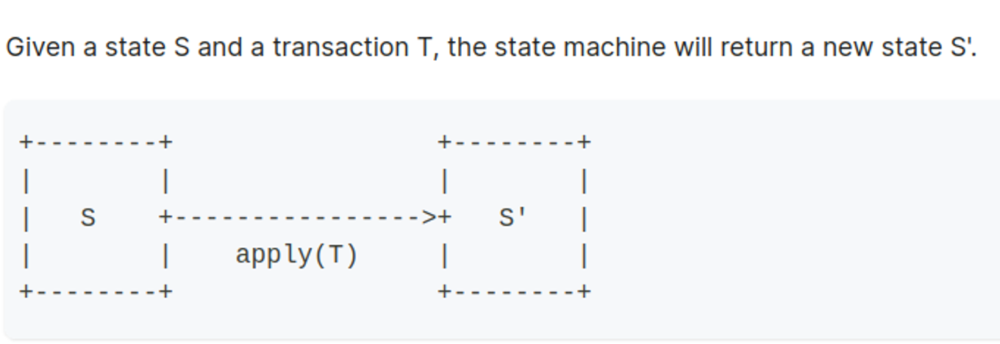
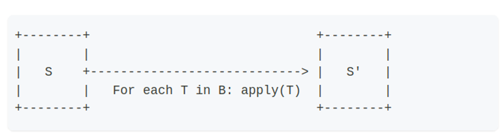
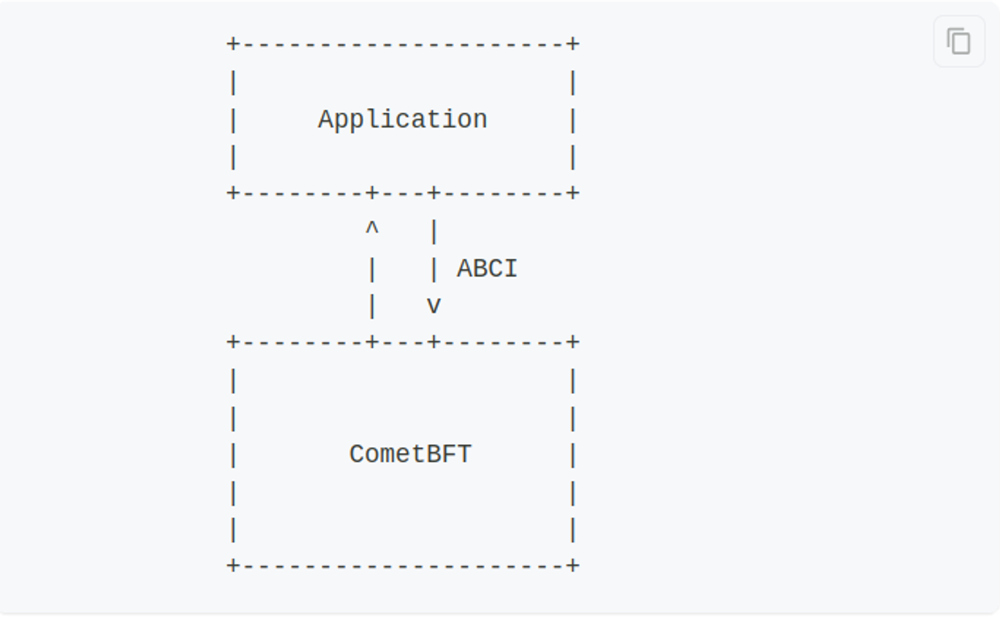
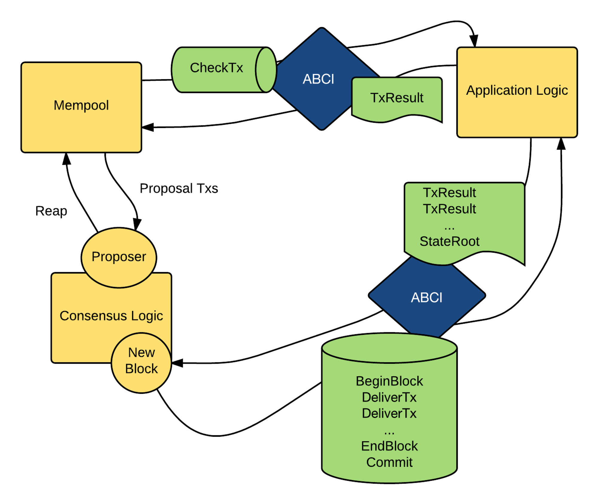
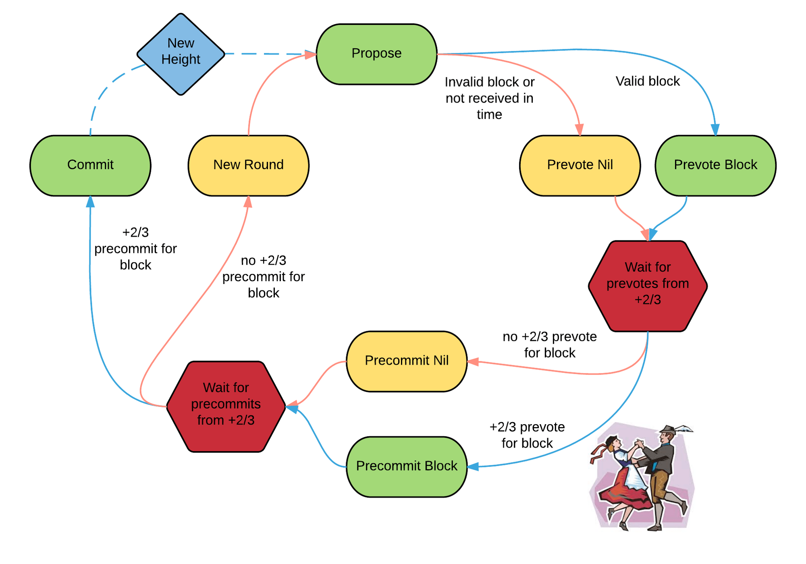

# Blockchain architecture




- When there are transactions come, we will loop all transactions in a block and apply to state.
- Now S will become S’.


- - Now the process of transfering new transaction or connect to other nodes will be made by CometBFT, and our job is reduced to define the state-machine (application). And this state-machine which is supported by the Cosmos SDK.
- CometBFT is responsible for propagating and ordering transaction bytes.
- The CometBFT [consensus algorithm](https://docs.cometbft.com/v0.37/introduction/what-is-cometbft#consensus-overview) works with a set of special nodes called *Validators.*
- At any given block, there is a validator set V. A validator in V is chosen by the algorithm to be the proposer of the next block.
- This block is considered valid if more than two thirds of V signed a `prevote` and a `precommit` on it, and if all the transactions that it contains are valid.
- The validator set can be changed by rules written in the state-machine.


### **Example Workflow**

1. **Transaction Submission:**
    - A user submits a transaction to the blockchain.
    - The transaction is broadcast to all CometBFT nodes.
2. **Consensus Process:**
    - Nodes validate the transaction and reach consensus on its inclusion in the next block.
    - A block is proposed and agreed upon by the majority of nodes.
3. **Block Processing:**
    - The proposed block is passed to the Cosmos SDK.
    - The SDK executes the transactions, updates the state, and applies any business logic.
4. **State Update:**
    - The updated state is stored in the blockchain's state database.
    - CometBFT ensures that all nodes have the same updated state.

# ABCI

- Which path does the CometBFT transfer to our Application ?
    


- CometBFT only uses byte array when transfer, no need to know what inside them.
- When ComnetBFT receives new transactions, it will come up with the following steps:
    1. `CheckTx`: When a transaction is received by CometBFT, it is passed to the application to check if a few basic requirements are met. 
    2. `DeliverTx`: When a [valid block](https://docs.cometbft.com/v0.37/spec/core/data_structures#block) is received by CometBFT, each transaction in the block is passed to the application via `DeliverTx` in order to be processed
    3. `BeginBlock`/`EndBlock`: These messages are executed at the beginning and the end of each block, whether the block contains transactions or not.
    

# Main components of cosmos-sdk

- **baseapp**: `baseapp` is the boilerplate implementation of a Cosmos SDK application. It comes with an implementation of the ABCI to handle the connection with the underlying consensus engine.
    
    ```go
    // SimApp extends an ABCI application, but with most of its parameters exported.
    // They are exported for convenience in creating helper functions, as object
    // capabilities aren't needed for testing.
    type SimApp struct {
    	*baseapp.BaseApp
    	legacyAmino       *codec.LegacyAmino
    	appCodec          codec.Codec
    	txConfig          client.TxConfig
    	interfaceRegistry types.InterfaceRegistry
    
    	// keys to access the substores
    	keys  map[string]*storetypes.KVStoreKey
    	tkeys map[string]*storetypes.TransientStoreKey
    
    	// keepers
    	AccountKeeper         authkeeper.AccountKeeper
    	BankKeeper            bankkeeper.Keeper
    	StakingKeeper         *stakingkeeper.Keeper
    	SlashingKeeper        slashingkeeper.Keeper
    	MintKeeper            mintkeeper.Keeper
    	DistrKeeper           distrkeeper.Keeper
    	GovKeeper             govkeeper.Keeper
    	CrisisKeeper          *crisiskeeper.Keeper
    	UpgradeKeeper         *upgradekeeper.Keeper
    	ParamsKeeper          paramskeeper.Keeper
    	AuthzKeeper           authzkeeper.Keeper
    	EvidenceKeeper        evidencekeeper.Keeper
    	FeeGrantKeeper        feegrantkeeper.Keeper
    	GroupKeeper           groupkeeper.Keeper
    	NFTKeeper             nftkeeper.Keeper
    	ConsensusParamsKeeper consensusparamkeeper.Keeper
    	CircuitKeeper         circuitkeeper.Keeper
    
    	// the module manager
    	ModuleManager      *module.Manager
    	BasicModuleManager module.BasicManager
    
    	// simulation manager
    	sm *module.SimulationManager
    
    	// module configurator
    	configurator module.Configurator
    }
    ```
    
- **Multistore**: allows developers to declare any number of [`KVStores`](https://docs.cosmos.network/main/learn/advanced/store#base-layer-kvstores). These `KVStores` only accept the `[]byte` type as value and therefore any custom structure needs to be marshalled using [a codec](https://docs.cosmos.network/main/learn/advanced/encoding) before being stored.
- **Modules:**

```
                                  +
                                  |
                                  |  Transaction relayed from the full-node's
                                  |  CometBFT engine to the node's application
                                  |  via DeliverTx
                                  |
                                  |
            +---------------------v--------------------------+
            |                 APPLICATION                    |
            |                                                |
            |     Using baseapp's methods: Decode the Tx,    |
            |     extract and route the message(s)           |
            |                                                |
            +---------------------+--------------------------+
                                  |
                                  |
                                  |
                                  +---------------------------+
                                                              |
                                                              |
                                                              |  Message routed to
                                                              |  the correct module
                                                              |  to be processed
                                                              |
                                                              |
                                                             +----------------+  +---------------+  +----------------+  +------v----------+
|                |  |               |  |                |  |                 |
|  AUTH MODULE   |  |  BANK MODULE  |  | STAKING MODULE |  |   GOV MODULE    |
|                |  |               |  |                |  |                 |
|                |  |               |  |                |  | Handles message,|
|                |  |               |  |                |  | Updates state   |
|                |  |               |  |                |  |                 |
+----------------+  +---------------+  +----------------+  +------+----------+
                                                                  |
                                                                  |
                                                                  |
                                                                  |
                                       +--------------------------+
                                       |
                                       | Return result to CometBFT
                                       | (0=Ok, 1=Err)
                                       v

```

- modules are microservices-like modules which manage one domain. Like in microservices we have many services (user, bank, staking, order, inventory, …) and we have the same things in cosmos sdk which called module.
- 

Cosmos SDK modules are defined in the `x/` folder of the Cosmos SDK. Some core modules include:

- `x/auth`: Used to manage accounts and signatures.
- `x/bank`: Used to enable tokens and token transfers.
- `x/staking` + `x/slashing`: Used to build Proof-Of-Stake blockchains.

```
        --------------------------
        | Receive Block Proposal |
        --------------------------
                    |
                    v
        -------------------------
        |     FinalizeBlock     |
        -------------------------
                    |
                    v
            -------------------
            |   BeginBlock    |
            -------------------
                    |
                    v
            --------------------
            | ExecuteTx(tx0)   |
            | ExecuteTx(tx1)   |
            | ExecuteTx(tx2)   |
            | ExecuteTx(tx3)   |
            |       .          |
            |       .          |
            |       .          |
            -------------------
                    |
                    v
            --------------------
            |    EndBlock      |
            --------------------
                    |
                    v
        -----------------------
        |      Consensus      |
        -----------------------
                  |
                  v
        -----------------------
        |     Commit          |
        -----------------------

```

# Fullnode

```
                ^  +-------------------------------+  ^
                |  |                               |  |
                |  |  State-machine = Application  |  |
                |  |                               |  |   Built with Cosmos SDK
                |  |            ^      +           |  |
                |  +----------- | ABCI | ----------+  v
                |  |            +      v           |  ^
                |  |                               |  |
Blockchain Node |  |           Consensus           |  |
                |  |                               |  |
                |  +-------------------------------+  |   CometBFT
                |  |                               |  |
                |  |           Networking          |  |
                |  |                               |  |
                v  +-------------------------------+  v

```

The blockchain full-node presents itself as a binary, generally suffixed by `-d` for "daemon" (e.g. `appd` for `app` or `gaiad` for `gaia`). This binary is built by running a simple [`main.go`](https://docs.cosmos.network/main/learn/advanced/node#main-function) function placed in `./cmd/appd/`. This operation usually happens through the [Makefile](https://docs.cosmos.network/main/learn/beginner/app-anatomy#dependencies-and-makefile).

Once the main binary is built, the node can be started by running the [`start` command](https://docs.cosmos.network/main/learn/advanced/node#start-command). This command function primarily does three things:

1. Create an instance of the state-machine defined in [`app.go`](https://docs.cosmos.network/main/learn/beginner/app-anatomy#core-application-file).
2. Initialize the state-machine with the latest known state, extracted from the `db` stored in the `~/.app/data` folder. At this point, the state-machine is at height `appBlockHeight`.
3. Create and start a new CometBFT instance. Among other things, the node performs a handshake with its peers. It gets the latest `blockHeight` from them and replays blocks to sync to this height if it is greater than the local `appBlockHeight`. The node starts from genesis and CometBFT sends an `InitChain` message via the ABCI to the `app`, which triggers the [`InitChainer`](https://docs.cosmos.network/main/learn/beginner/app-anatomy#initchainer).

# DEMO

https://github.com/leductoan3082004/blog-blockchain

Note: should use the ignite with version v0.26, It is more stable than v0.28 (this version will cause error when experiencing with IBC).

1. **Create a Post:**

```bash
blogd tx blog create-post hello world --from alice --chain-id blog

```

1. **View a Post:**

```bash
blogd q blog show-post 0

```

1. **List All Posts:**

```bash
blogd q blog list-post

```

1. **Update a Post:**

```bash
blogd tx blog update-post "Hello" "Cosmos" 0 --from alice --chain-id blog

```

1. **Delete a Post:**

```bash
blogd tx blog delete-post 0 --from alice  --chain-id blog

```

# CometBFT




`go run github.com/cometbft/cometbft/cmd/cometbft@v0.38.0 init --home /tmp/cometbft-home`

`go build -mod**=**mod` 

`./app -kv-home /tmp/badger-home`

`go run github.com/cometbft/cometbft/cmd/cometbft@v0.38.0 node --home /tmp/cometbft-home --proxy_app**=**unix://example.sock`