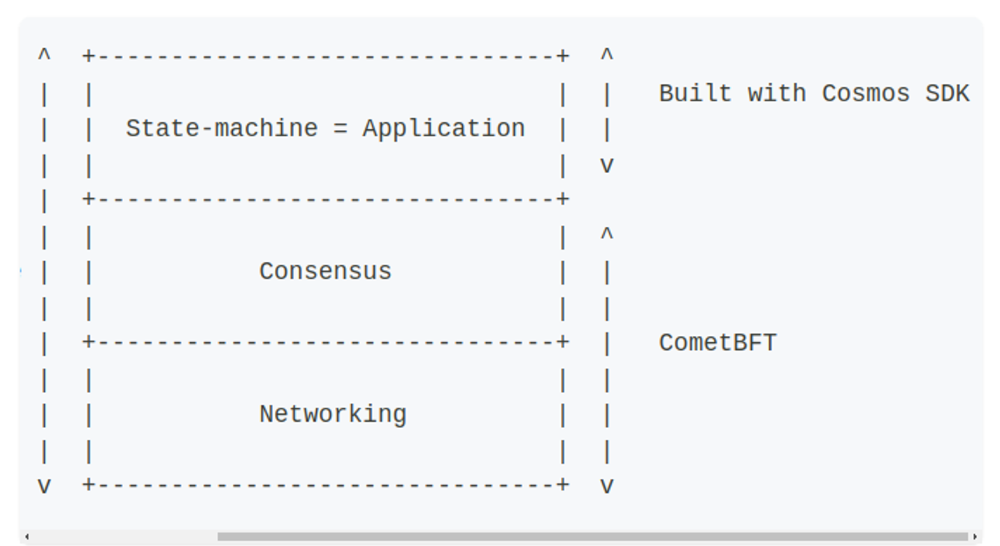

# Blockchain architecture


- When there are transactions come, we will loop all transactions in a block and apply to state.
- Now S will become S’.



- - Now the process of transfering new transaction or connect to other nodes will be made by CometBFT, and our job is reduced to define the state-machine (application). And this state-machine which is supported by the Cosmos SDK.
- CometBFT is responsible for propagating and ordering transaction bytes.
- The CometBFT [consensus algorithm](https://docs.cometbft.com/v0.37/introduction/what-is-cometbft#consensus-overview) works with a set of special nodes called *Validators.*
- At any given block, there is a validator set V. A validator in V is chosen by the algorithm to be the proposer of the next block.
- This block is considered valid if more than two thirds of V signed a `prevote` and a `precommit` on it, and if all the transactions that it contains are valid.
- The validator set can be changed by rules written in the state-machine.


### **Example Workflow**

1. **Transaction Submission:**
    - A user submits a transaction to the blockchain.
    - The transaction is broadcast to all CometBFT nodes.
2. **Consensus Process:**
    - Nodes validate the transaction and reach consensus on its inclusion in the next block.
    - A block is proposed and agreed upon by the majority of nodes.
3. **Block Processing:**
    - The proposed block is passed to the Cosmos SDK.
    - The SDK executes the transactions, updates the state, and applies any business logic.
4. **State Update:**
    - The updated state is stored in the blockchain's state database.
    - CometBFT ensures that all nodes have the same updated state.

# ABCI

- Which path does the CometBFT transfer to our Application ?
    


- CometBFT only uses byte array when transfer, no need to know what inside them.
- When ComnetBFT receives new transactions, it will come up with the following steps:
    1. `CheckTx`: When a transaction is received by CometBFT, it is passed to the application to check if a few basic requirements are met. 
    2. `DeliverTx`: When a [valid block](https://docs.cometbft.com/v0.37/spec/core/data_structures#block) is received by CometBFT, each transaction in the block is passed to the application via `DeliverTx` in order to be processed
    3. `BeginBlock`/`EndBlock`: These messages are executed at the beginning and the end of each block, whether the block contains transactions or not.
    

# Main components of cosmos-sdk

- **baseapp**: `baseapp` is the boilerplate implementation of a Cosmos SDK application. It comes with an implementation of the ABCI to handle the connection with the underlying consensus engine.
    
    ```go
    // SimApp extends an ABCI application, but with most of its parameters exported.
    // They are exported for convenience in creating helper functions, as object
    // capabilities aren't needed for testing.
    type SimApp struct {
    	*baseapp.BaseApp
    	legacyAmino       *codec.LegacyAmino
    	appCodec          codec.Codec
    	txConfig          client.TxConfig
    	interfaceRegistry types.InterfaceRegistry
    
    	// keys to access the substores
    	keys  map[string]*storetypes.KVStoreKey
    	tkeys map[string]*storetypes.TransientStoreKey
    
    	// keepers
    	AccountKeeper         authkeeper.AccountKeeper
    	BankKeeper            bankkeeper.Keeper
    	StakingKeeper         *stakingkeeper.Keeper
    	SlashingKeeper        slashingkeeper.Keeper
    	MintKeeper            mintkeeper.Keeper
    	DistrKeeper           distrkeeper.Keeper
    	GovKeeper             govkeeper.Keeper
    	CrisisKeeper          *crisiskeeper.Keeper
    	UpgradeKeeper         *upgradekeeper.Keeper
    	ParamsKeeper          paramskeeper.Keeper
    	AuthzKeeper           authzkeeper.Keeper
    	EvidenceKeeper        evidencekeeper.Keeper
    	FeeGrantKeeper        feegrantkeeper.Keeper
    	GroupKeeper           groupkeeper.Keeper
    	NFTKeeper             nftkeeper.Keeper
    	ConsensusParamsKeeper consensusparamkeeper.Keeper
    	CircuitKeeper         circuitkeeper.Keeper
    
    	// the module manager
    	ModuleManager      *module.Manager
    	BasicModuleManager module.BasicManager
    
    	// simulation manager
    	sm *module.SimulationManager
    
    	// module configurator
    	configurator module.Configurator
    }
    ```
    
- **Multistore**: allows developers to declare any number of [`KVStores`](https://docs.cosmos.network/main/learn/advanced/store#base-layer-kvstores). These `KVStores` only accept the `[]byte` type as value and therefore any custom structure needs to be marshalled using [a codec](https://docs.cosmos.network/main/learn/advanced/encoding) before being stored.
- **Modules:**

```
                                  +
                                  |
                                  |  Transaction relayed from the full-node's
                                  |  CometBFT engine to the node's application
                                  |  via DeliverTx
                                  |
                                  |
            +---------------------v--------------------------+
            |                 APPLICATION                    |
            |                                                |
            |     Using baseapp's methods: Decode the Tx,    |
            |     extract and route the message(s)           |
            |                                                |
            +---------------------+--------------------------+
                                  |
                                  |
                                  |
                                  +---------------------------+
                                                              |
                                                              |
                                                              |  Message routed to
                                                              |  the correct module
                                                              |  to be processed
                                                              |
                                                              |
                                                             +----------------+  +---------------+  +----------------+  +------v----------+
|                |  |               |  |                |  |                 |
|  AUTH MODULE   |  |  BANK MODULE  |  | STAKING MODULE |  |   GOV MODULE    |
|                |  |               |  |                |  |                 |
|                |  |               |  |                |  | Handles message,|
|                |  |               |  |                |  | Updates state   |
|                |  |               |  |                |  |                 |
+----------------+  +---------------+  +----------------+  +------+----------+
                                                                  |
                                                                  |
                                                                  |
                                                                  |
                                       +--------------------------+
                                       |
                                       | Return result to CometBFT
                                       | (0=Ok, 1=Err)
                                       v

```

- modules are microservices-like modules which manage one domain. Like in microservices we have many services (user, bank, staking, order, inventory, …) and we have the same things in cosmos sdk which called module.
- 

Cosmos SDK modules are defined in the `x/` folder of the Cosmos SDK. Some core modules include:

- `x/auth`: Used to manage accounts and signatures.
- `x/bank`: Used to enable tokens and token transfers.
- `x/staking` + `x/slashing`: Used to build Proof-Of-Stake blockchains.

```
        --------------------------
        | Receive Block Proposal |
        --------------------------
                    |
                    v
        -------------------------
        |     FinalizeBlock     |
        -------------------------
                    |
                    v
            -------------------
            |   BeginBlock    |
            -------------------
                    |
                    v
            --------------------
            | ExecuteTx(tx0)   |
            | ExecuteTx(tx1)   |
            | ExecuteTx(tx2)   |
            | ExecuteTx(tx3)   |
            |       .          |
            |       .          |
            |       .          |
            -------------------
                    |
                    v
            --------------------
            |    EndBlock      |
            --------------------
                    |
                    v
        -----------------------
        |      Consensus      |
        -----------------------
                  |
                  v
        -----------------------
        |     Commit          |
        -----------------------

```

# Fullnode

```
                ^  +-------------------------------+  ^
                |  |                               |  |
                |  |  State-machine = Application  |  |
                |  |                               |  |   Built with Cosmos SDK
                |  |            ^      +           |  |
                |  +----------- | ABCI | ----------+  v
                |  |            +      v           |  ^
                |  |                               |  |
Blockchain Node |  |           Consensus           |  |
                |  |                               |  |
                |  +-------------------------------+  |   CometBFT
                |  |                               |  |
                |  |           Networking          |  |
                |  |                               |  |
                v  +-------------------------------+  v

```

The blockchain full-node presents itself as a binary, generally suffixed by `-d` for "daemon" (e.g. `appd` for `app` or `gaiad` for `gaia`). This binary is built by running a simple [`main.go`](https://docs.cosmos.network/main/learn/advanced/node#main-function) function placed in `./cmd/appd/`. This operation usually happens through the [Makefile](https://docs.cosmos.network/main/learn/beginner/app-anatomy#dependencies-and-makefile).

Once the main binary is built, the node can be started by running the [`start` command](https://docs.cosmos.network/main/learn/advanced/node#start-command). This command function primarily does three things:

1. Create an instance of the state-machine defined in [`app.go`](https://docs.cosmos.network/main/learn/beginner/app-anatomy#core-application-file).
2. Initialize the state-machine with the latest known state, extracted from the `db` stored in the `~/.app/data` folder. At this point, the state-machine is at height `appBlockHeight`.
3. Create and start a new CometBFT instance. Among other things, the node performs a handshake with its peers. It gets the latest `blockHeight` from them and replays blocks to sync to this height if it is greater than the local `appBlockHeight`. The node starts from genesis and CometBFT sends an `InitChain` message via the ABCI to the `app`, which triggers the [`InitChainer`](https://docs.cosmos.network/main/learn/beginner/app-anatomy#initchainer).

# DEMO

https://github.com/leductoan3082004/blog-blockchain

Note: should use the ignite with version v0.26, It is more stable than v0.28 (this version will cause error when experiencing with IBC).

1. **Create a Post:**

```bash
blogd tx blog create-post hello world --from alice --chain-id blog

```

1. **View a Post:**

```bash
blogd q blog show-post 0

```

1. **List All Posts:**

```bash
blogd q blog list-post

```

1. **Update a Post:**

```bash
blogd tx blog update-post "Hello" "Cosmos" 0 --from alice --chain-id blog

```

1. **Delete a Post:**

```bash
blogd tx blog delete-post 0 --from alice  --chain-id blog

```

# CometBFT


`go run github.com/cometbft/cometbft/cmd/cometbft@v0.38.0 init --home /tmp/cometbft-home`

`go build -mod**=**mod` 

`./app -kv-home /tmp/badger-home`

`go run github.com/cometbft/cometbft/cmd/cometbft@v0.38.0 node --home /tmp/cometbft-home --proxy_app**=**unix://example.sock`


First make sure you have ignite installed on your machine.

https://docs.ignite.com/welcome/install

Follow this document to install ignite, it’s quite simple.

Note: this is latest version of ignite, and just use it to build single chain, we will down version of ignite if we wanna build multiple blockchains and ensure network for them to communicate. (this will be discuss later in another document).

## Cosmos SDK overview

Cosmos SDK is a framework to build a simple blockchain based on our application logic. The consensus and network part is isolated from this. So we just focus to build our application based blockchain.

## Simple blog using cosmos sdk

- First ensure your ignite cli installed in the very first step.
- This is like a blog website where you can have some CRUD methods to interact with backend and databases. But this is created in blockchain.

Now let’s get started

## **Creating the Blog Blockchain[](https://docs.ignite.com/guide/blog#creating-the-blog-blockchain)**

1. **Initialize the Blockchain:**

```bash
ignite scaffold chain blog
cd blog
```

This will create a simple folder called **blog,** and generate our essensial code for us (like networking, grpc protobuf, consensus, import module, …)

And it will create our module called **blog** also for us. This module can be found at the **x/** folder.

1. **Define the Post Type:**

```bash
ignite scaffold type post title body creator id:uint
```

This step creates a Post type with title (string), body (string), creator (string), and id (unsigned integer) fields.

## Implement CRUD operations.

**Creating Posts**

1. **Scaffold Create Message**

```bash
ignite scaffold message create-post title body --response id:uint
```

This message allows users to create posts with a title and body.

Explain more: just imagine that you request a message with **body and title** (this can be a json structure). And u want to receive a response with id.

1. **Append Posts to the Store:**

Create the file `x/blog/keeper/post.go`.

Implement `AppendPost` and the following functions in `x/blog/keeper/post.go` to add posts to the store.

**x/blog/keeper/post.go**

```go
package keeper

import (
    "encoding/binary"

    "cosmossdk.io/store/prefix"
    "github.com/cosmos/cosmos-sdk/runtime"
    sdk "github.com/cosmos/cosmos-sdk/types"

    "blog/x/blog/types"
)

func (k Keeper) AppendPost(ctx sdk.Context, post types.Post) uint64 {
    count := k.GetPostCount(ctx)
    post.Id = count
    storeAdapter := runtime.KVStoreAdapter(k.storeService.OpenKVStore(ctx))
    store := prefix.NewStore(storeAdapter, types.KeyPrefix(types.PostKey))
    appendedValue := k.cdc.MustMarshal(&post)
    store.Set(GetPostIDBytes(post.Id), appendedValue)
    k.SetPostCount(ctx, count+1)
    return count
}

func (k Keeper) GetPostCount(ctx sdk.Context) uint64 {
    storeAdapter := runtime.KVStoreAdapter(k.storeService.OpenKVStore(ctx))
    store := prefix.NewStore(storeAdapter, []byte{})
    byteKey := types.KeyPrefix(types.PostCountKey)
    bz := store.Get(byteKey)
    if bz == nil {
        return 0
    }
    return binary.BigEndian.Uint64(bz)
}

func GetPostIDBytes(id uint64) []byte {
    bz := make([]byte, 8)
    binary.BigEndian.PutUint64(bz, id)
    return bz
}

func (k Keeper) SetPostCount(ctx sdk.Context, count uint64) {
    storeAdapter := runtime.KVStoreAdapter(k.storeService.OpenKVStore(ctx))
    store := prefix.NewStore(storeAdapter, []byte{})
    byteKey := types.KeyPrefix(types.PostCountKey)
    bz := make([]byte, 8)
    binary.BigEndian.PutUint64(bz, count)
    store.Set(byteKey, bz)
}

func (k Keeper) GetPost(ctx sdk.Context, id uint64) (val types.Post, found bool) {
    storeAdapter := runtime.KVStoreAdapter(k.storeService.OpenKVStore(ctx))
    store := prefix.NewStore(storeAdapter, types.KeyPrefix(types.PostKey))
    b := store.Get(GetPostIDBytes(id))
    if b == nil {
        return val, false
    }
    k.cdc.MustUnmarshal(b, &val)
    return val, true
}

```

1. **Add Post key prefix:**

Add the `PostKey` and `PostCountKey` functions to the `x/blog/types/keys.go` file:

**x/blog/types/keys.go**

```go
// PostKey is used to uniquely identify posts within the system.
// It will be used as the beginning of the key for each post, followed bei their unique ID
    PostKey = "Post/value/"

// This key will be used to keep track of the ID of the latest post added to the store.
    PostCountKey = "Post/count/"

```

1. **Update Create Post:**

Update the `x/blog/keeper/msg_server_create_post.go` file with the `CreatePost` function:

**x/blog/keeper/msg_server_create_post.go**

```go
package keeper

import (
    "context"

    sdk "github.com/cosmos/cosmos-sdk/types"

    "blog/x/blog/types"
)

func (k msgServer) CreatePost(goCtx context.Context, msg *types.MsgCreatePost) (*types.MsgCreatePostResponse, error) {
    ctx := sdk.UnwrapSDKContext(goCtx)
    var post = types.Post{
        Creator: msg.Creator,
        Title:   msg.Title,
        Body:    msg.Body,
    }
    id := k.AppendPost(
        ctx,
        post,
    )
    return &types.MsgCreatePostResponse{
        Id: id,
    }, nil
}

```

**Updating Posts**

1. **Scaffold Update Message:**

```bash
ignite scaffold message update-post title body id:uint

```

This command allows for updating existing posts specified by their ID.

1. **Update Logic**

Implement `SetPost` in `x/blog/keeper/post.go` for updating posts in the store.

**x/blog/keeper/post.go**

```go
func (k Keeper) SetPost(ctx sdk.Context, post types.Post) {
    storeAdapter := runtime.KVStoreAdapter(k.storeService.OpenKVStore(ctx))
    store := prefix.NewStore(storeAdapter, types.KeyPrefix(types.PostKey))
    b := k.cdc.MustMarshal(&post)
    store.Set(GetPostIDBytes(post.Id), b)
}

```

Refine the `UpdatePost` function in `x/blog/keeper/msg_server_update_post.go`.

**x/blog/keeper/msg_server_update_post.go**

```go
package keeper

import (
    "context"
    "fmt"

    errorsmod "cosmossdk.io/errors"
    sdk "github.com/cosmos/cosmos-sdk/types"
    sdkerrors "github.com/cosmos/cosmos-sdk/types/errors"

    "blog/x/blog/types"
)

func (k msgServer) UpdatePost(goCtx context.Context, msg *types.MsgUpdatePost) (*types.MsgUpdatePostResponse, error) {
    ctx := sdk.UnwrapSDKContext(goCtx)
    var post = types.Post{
        Creator: msg.Creator,
        Id:      msg.Id,
        Title:   msg.Title,
        Body:    msg.Body,
    }
    val, found := k.GetPost(ctx, msg.Id)
    if !found {
        return nil, errorsmod.Wrap(sdkerrors.ErrKeyNotFound, fmt.Sprintf("key %d doesn't exist", msg.Id))
    }
    if msg.Creator != val.Creator {
        return nil, errorsmod.Wrap(sdkerrors.ErrUnauthorized, "incorrect owner")
    }
    k.SetPost(ctx, post)
    return &types.MsgUpdatePostResponse{}, nil
}

```

**Deleting Posts**

1. **Scaffold Delete Message:**

```bash
ignite scaffold message delete-post id:uint

```

This command enables the deletion of posts by their ID.

1. **Delete Logic:**

Implement RemovePost in `x/blog/keeper/post.go` to delete posts from the store.

**x/blog/keeper/post.go**

```go
func (k Keeper) RemovePost(ctx sdk.Context, id uint64) {
    storeAdapter := runtime.KVStoreAdapter(k.storeService.OpenKVStore(ctx))
    store := prefix.NewStore(storeAdapter, types.KeyPrefix(types.PostKey))
    store.Delete(GetPostIDBytes(id))
}

```

Add the according logic to `x/blog/keeper/msg_server_delete_post`.

**x/blog/keeper/msg_server_delete_post.go**

```go
package keeper

import (
    "context"
    "fmt"

    errorsmod "cosmossdk.io/errors"
    sdk "github.com/cosmos/cosmos-sdk/types"
    sdkerrors "github.com/cosmos/cosmos-sdk/types/errors"

    "blog/x/blog/types"
)

func (k msgServer) DeletePost(goCtx context.Context, msg *types.MsgDeletePost) (*types.MsgDeletePostResponse, error) {
    ctx := sdk.UnwrapSDKContext(goCtx)
    val, found := k.GetPost(ctx, msg.Id)
    if !found {
        return nil, errorsmod.Wrap(sdkerrors.ErrKeyNotFound, fmt.Sprintf("key %d doesn't exist", msg.Id))
    }
    if msg.Creator != val.Creator {
        return nil, errorsmod.Wrap(sdkerrors.ErrUnauthorized, "incorrect owner")
    }
    k.RemovePost(ctx, msg.Id)
    return &types.MsgDeletePostResponse{}, nil
}

```

**Reading Posts**

1. **Scaffold Query Messages:**

**proto/blog/blog/query.proto**

```bash
ignite scaffold query show-post id:uint --response post:Post
ignite scaffold query list-post --response post:Post --paginated

```

These queries allow for retrieving a single post by ID and listing all posts with pagination.

1. **Query Implementation:**

Implement `ShowPost` in `x/blog/keeper/query_show_post.go`.

**x/blog/keeper/query_show_post.go**

```go
package keeper

import (
    "context"

    sdk "github.com/cosmos/cosmos-sdk/types"
    sdkerrors "github.com/cosmos/cosmos-sdk/types/errors"
    "google.golang.org/grpc/codes"
    "google.golang.org/grpc/status"

    "blog/x/blog/types"
)

func (k Keeper) ShowPost(goCtx context.Context, req *types.QueryShowPostRequest) (*types.QueryShowPostResponse, error) {
    if req == nil {
        return nil, status.Error(codes.InvalidArgument, "invalid request")
    }

    ctx := sdk.UnwrapSDKContext(goCtx)
    post, found := k.GetPost(ctx, req.Id)
    if !found {
        return nil, sdkerrors.ErrKeyNotFound
    }

    return &types.QueryShowPostResponse{Post: post}, nil
}

```

Implement `ListPost` in `x/blog/keeper/query_list_post.go`.

**x/blog/keeper/query_list_post.go**

```go
package keeper

import (
    "context"

    "cosmossdk.io/store/prefix"
    "github.com/cosmos/cosmos-sdk/runtime"
    "github.com/cosmos/cosmos-sdk/types/query"
    "google.golang.org/grpc/codes"
    "google.golang.org/grpc/status"

    "blog/x/blog/types"
)

func (k Keeper) ListPost(ctx context.Context, req *types.QueryListPostRequest) (*types.QueryListPostResponse, error) {
    if req == nil {
        return nil, status.Error(codes.InvalidArgument, "invalid request")
    }

    storeAdapter := runtime.KVStoreAdapter(k.storeService.OpenKVStore(ctx))
    store := prefix.NewStore(storeAdapter, types.KeyPrefix(types.PostKey))

    var posts []types.Post
    pageRes, err := query.Paginate(store, req.Pagination, func(key []byte, value []byte) error {
        var post types.Post
        if err := k.cdc.Unmarshal(value, &post); err != nil {
            return err
        }

        posts = append(posts, post)
        return nil
    })

    if err != nil {
        return nil, status.Error(codes.Internal, err.Error())
    }

    return &types.QueryListPostResponse{Post: posts, Pagination: pageRes}, nil
}

```

1. **Proto Implementation:**

Add a `repeated` keyword to return a list of posts in `QueryListPostResponse` and include the option `[(gogoproto.nullable) = false]` in `QueryShowPostResponse` and `QueryListPostResponse` to generate the field without a pointer.

**proto/blog/blog/query.proto**

```
message QueryShowPostResponse {
  Post post = 1 [(gogoproto.nullable) = false];
}

message QueryListPostResponse {
  repeated Post post = 1 [(gogoproto.nullable) = false];
  cosmos.base.query.v1beta1.PageResponse pagination = 2;
}

```

**Interacting with the Blog**

1. **Create a Post:**

```bash
blogd tx blog create-post hello world --from alice --chain-id blog

```

1. **View a Post:**

```bash
blogd q blog show-post 0

```

1. **List All Posts:**

```bash
blogd q blog list-post

```

1. **Update a Post:**

```bash
blogd tx blog update-post "Hello" "Cosmos" 0 --from alice --chain-id blog

```

1. **Delete a Post:**

```bash
blogd tx blog delete-post 0 --from alice  --chain-id blog

```


### **Build a new blockchain[](https://docs.ignite.com/guide/ibc#build-a-new-blockchain)**

To scaffold a new blockchain named `planet`:

```bash
ignite scaffold chain planet --no-module
cd planet
```

To scaffold a module named `blog`:

`ignite scaffold module blog --ibc`

- Creating blog posts
    
    ```bash
    ignite scaffold list post title content creator --no-message --module blog
    
    ```
    
- Processing acknowledgments for sent posts
    
    ```bash
    ignite scaffold list sentPost postID title chain creator --no-message --module blog
    
    ```
    
- Managing post timeouts
    
    ```bash
    ignite scaffold list timedoutPost title chain creator --no-message --module blog
    
    ```
    

The scaffolded code includes proto files for defining data structures, messages, messages handlers, keepers for modifying the state, and CLI commands.

The `ignite packet` command creates the logic for an IBC packet that can be sent to another blockchain.

- The `title` and `content` are stored on the target chain.
- The `postID` is acknowledged on the sending chain.

To scaffold a sendable and interpretable IBC packet:

```bash
ignite scaffold packet ibcPost title content --ack postID --module blog
```

Notice the fields in the `ibcPost` packet match the fields in the `post` type that you created earlier.

- The `-ack` flag defines which identifier is returned to the sending blockchain.
- The `-module` flag specifies to create the packet in a particular IBC module.

- Stop your blockchains and delete previous configuration files:
    
    `rm -rf ~/.ignite/relayer`
    

Open a terminal window and run the following command to start the `earth` blockchain:

```bash
ignite chain serve -c earth.yml

```

Open a different terminal window and run the following command to start the `mars` blockchain:

```bash
ignite chain serve -c mars.yml

```

### **Configure and start the relayer[](https://docs.ignite.com/guide/ibc#configure-and-start-the-relayer)**

First, configure the relayer. Use the Ignite CLI `configure` command with the `--advanced` option:

```bash
ignite relayer configure -a \
  --source-rpc "http://0.0.0.0:26657" \
  --source-faucet "http://0.0.0.0:4500" \
  --source-port "blog" \
  --source-version "blog-1" \
  --source-gasprice "0.0000025stake" \
  --source-prefix "cosmos" \
  --source-gaslimit 300000 \
  --target-rpc "http://0.0.0.0:26659" \
  --target-faucet "http://0.0.0.0:4501" \
  --target-port "blog" \
  --target-version "blog-1" \
  --target-gasprice "0.0000025stake" \
  --target-prefix "cosmos" \
  --target-gaslimit 300000

```

When prompted, press Enter to accept the default values for `Source Account` and `Target Account`.

In a new terminal window, start the relayer process:

`ignite relayer connect`

### **Send packets[](https://docs.ignite.com/guide/ibc#send-packets)**

You can now send packets and verify the received posts:

```bash
planetd tx blog send-ibc-post blog channel-0 "Hello" "Hello Mars, I'm Alice from Earth" --from alice --chain-id earth --home ~/.earth

```

To verify that the post has been received on Mars:

```bash
planetd q blog list-post --node tcp://localhost:26659

```

The packet has been received:

```yaml
Post:
  - content: Hello Mars, I'm Alice from Earth
    creator: blog-channel-0-cosmos1aew8dk9cs3uzzgeldatgzvm5ca2k4m98xhy20x
    id: "0"
    title: Hello
pagination:
  next_key: null
  total: "1"

```

To check if the packet has been acknowledged on Earth:

```bash
planetd q blog list-sent-post

```

Output:

```yaml
SentPost:
  - chain: blog-channel-0
    creator: cosmos1aew8dk9cs3uzzgeldatgzvm5ca2k4m98xhy20x
    id: "0"
    postID: "0"
    title: Hello
pagination:
  next_key: null
  total: "1"

```

To test timeout, set the timeout time of a packet to 1 nanosecond, verify that the packet is timed out, and check the timed-out posts:

```bash
planetd tx blog send-ibc-post blog channel-0 "Sorry" "Sorry Mars, you will never see this post" --from alice --chain-id earth --home ~/.earth --packet-timeout-timestamp 1

```

Check the timed-out posts:

```bash
planetd q blog list-timedout-post

```

Results:

```yaml
TimedoutPost:
  - chain: blog-channel-0
    creator: cosmos1fhpcsxn0g8uask73xpcgwxlfxtuunn3ey5ptjv
    id: "0"
    title: Sorry
pagination:
  next_key: null
  total: "2"

```

You can also send a post from Mars:

```bash
planetd tx blog send-ibc-post blog channel-0 "Hello" "Hello Earth, I'm Alice from Mars" --from alice --chain-id mars --home ~/.mars --node tcp://localhost:26659

```

List post on Earth:

```bash
planetd q blog list-post

```

Results:

```yaml
Post:
  - content: Hello Earth, I'm Alice from Mars
    creator: blog-channel-0-cosmos1xtpx43l826348s59au24p22pxg6q248638q2tf
    id: "0"
    title: Hello
pagination:
  next_key: null
  total: "1"

```